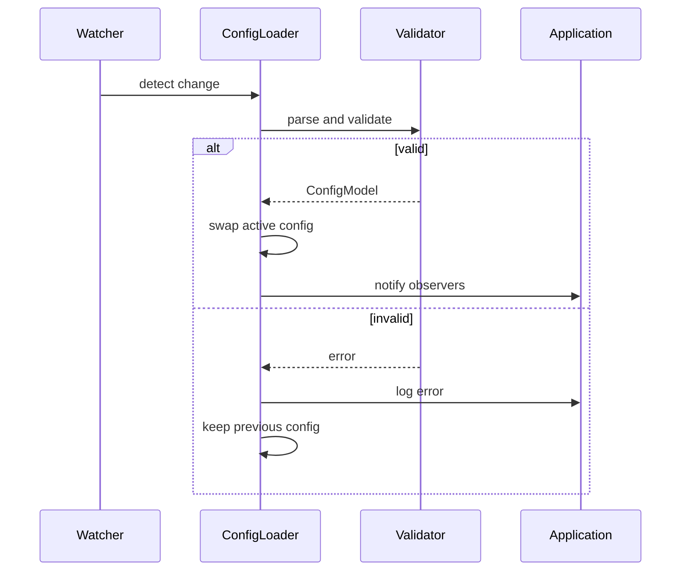

# Config Hot Reload

Hot reload updates configuration without restarting the system. A file or
service watcher emits events when the source changes. The application
validates the new content and swaps it into the active state atomically.

## Complexity

Watchers poll or receive events in constant time. Parsing updated content
runs in ``O(n)`` where ``n`` is file size.

## Timing Model

Let ``t_p`` denote the polling interval, ``t_v`` the validation time, and
``t_io`` the atomic rename latency. Detection latency is bounded by
``t_p``. The total reload latency ``L`` satisfies ``L <= t_p + t_v + t_io``.

## Failure Recovery

If validation fails, the previous configuration remains active. The atomic
rename prevents partial writes from replacing the live file, so a failed
swap leaves the system operating with the last valid snapshot.

## Sequence Diagram

## Invariants

- The active configuration always matches the last successfully validated
  snapshot.
- Failed validations keep the previous configuration active.
- Each active configuration satisfies the validator predicates.

## Convergence

Assume updates stop at time ``T``. The watcher observes the last write within
``t_p``. Validation completes in ``t_v`` and the atomic swap finishes in
``t_io``. By ``T + t_p + t_v + t_io`` the active state equals the final valid
snapshot and remains fixed, establishing convergence after reload.

## Empirical Results

Running ``uv run``
``scripts/simulate_config_reload.py /tmp/cfg.txt --updates 5 --interval 0.2``
yielded reload messages for values ``2`` and ``4``. The 0.2-second polling
interval detected every other rapid update due to the script writing at
``interval/2``.

See [simulate_config_reload.py](../../scripts/simulate_config_reload.py).

## Edge Cases

- Partial writes can surface invalid configuration snapshots.
- Race conditions may arise when multiple writers update the source.
- Fallback logic is needed when reload validation fails.

## Simulation

Automated tests confirm config hot reload behavior.

- [Spec](../specs/config.md)
- [Tests](../../tests/integration/test_config_hot_reload_components.py)
