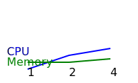

# Distributed Coordination

Agents operating in parallel need mechanisms for coalition formation,
efficient scheduling, and resilient failure recovery. The distributed
utilities in `src/autoresearch/distributed` provide these primitives.

## Coalition Formation

- `ResultAggregator` collects agent messages from a broker queue to form a
  shared state. See
  [coordinator.py](../../src/autoresearch/distributed/coordinator.py).
- `StorageCoordinator` persists claims from agents, enabling a common
  knowledge base across processes.

## Message Throughput

- Queue operations on the `multiprocessing.Queue` backing `InMemoryBroker`
  run in constant time. With `P` worker processes and average service time
  `t_s`, throughput is bounded by `P / t_s` messages per second.

## Broker Types

- `InMemoryBroker` wraps a shared `multiprocessing.Queue` and offers
  `O(1)` publish operations.
- `RedisBroker` pushes JSON strings to a Redis list; network latency is the
  dominant cost while each `rpush` is `O(1)` for message size `s`.
- `RayBroker` uses `ray.util.queue.Queue` to fan messages across workers with
  constant-time enqueue.

## Scheduling Complexity

- `ProcessExecutor.run_query` dispatches each agent through a multiprocessing
  pool per loop. For `L` loops over `A` agents with `P` workers, dispatching
  costs `O(L * A / P)` while pool management adds `O(L * P)`, yielding overall
  complexity `O(L * A)`
  ([executors.py](../../src/autoresearch/distributed/executors.py)).

## Failure Recovery

- `ProcessExecutor.shutdown` publishes `stop` actions and joins background
  processes so queues drain safely. Draining `M` queued messages across `P`
  workers and joining those processes bounds recovery time by `O(M / P + P)`
  ([executors.py](../../src/autoresearch/distributed/executors.py)).

## Speedup Model

For a workload with serial fraction `s` and parallel fraction `p`, Amdahl's
Law bounds speedup by `1 / (s + p / P)` where `P` is the number of workers.
Beyond that point additional workers yield diminishing returns.

## Monitoring

See [Resource Monitor](resource_monitor.md) for CPU and memory sampling models.

## Coordination Overhead Model

- For `P` processes sending control messages with latency `\ell` and payload
  size `s`, coordination cost is roughly `P * (\ell + s / B)` where `B` is
  broker bandwidth. Shared memory queues make `\ell` negligible, giving
overhead `O(P)`. A simple CPU-bound simulation showed average
utilization rising from ~0% with one node to ~30% with two nodes and
~40% with four nodes, while memory stayed near 45–49 MB.

## Formal Guarantees

### Leader Election

The coordinator selects the agent with the lowest identifier as the leader.
Given `n` unique identifiers, the election terminates in `O(n)` comparisons
and produces exactly one leader. The chosen identifier is guaranteed to
belong to the original set, ensuring safety and determinism
([simulation script][dc-sim]).

[dc-sim]: ../../scripts/distributed_coordination_sim.py

### Message Ordering

`InMemoryBroker` relies on ``multiprocessing.Queue`` and therefore preserves
first-in-first-out semantics. Messages are dequeued in the same order they
are published, yielding a total order consistent with enqueue time under a
single broker process
([broker.py](../../src/autoresearch/distributed/broker.py)).

## Baseline

Running `uv run scripts/simulate_distributed_coordination.py --workers 2`
`--tasks 100` processed 1\,000 tasks in about 0.22 s,
or roughly 4\,600 tasks/s. The simulation squares `tasks` integers across
10 loops, so the invariant `N = 10 \times tasks` fixes the workload size.
Throughput follows `T = N / t` where `N` is the number of tasks and `t` is
execution time.

## Simulation

A stress test using the `multiprocessing.Manager().Queue` backing
`InMemoryBroker` processed 10\,000 messages in 1.015 s, about 9\,854 msg/s.
When one worker crashed after 5\,000 messages, the remaining workers drained
the queue in 1.017 s, about 9\,834 msg/s. An empty `get` raised a timeout
after 0.1 s, providing an upper bound on failure detection latency.

## Performance Simulation

[`distributed_coordination_analysis.py`][dc-analysis]
runs CPU and memory simulations for 1, 2, and 4 workers and saves metrics to
[`distributed_metrics.json`](../../tests/analysis/distributed_metrics.json).
A plot of these metrics is shown below.

[dc-analysis]: ../../tests/analysis/distributed_coordination_analysis.py
