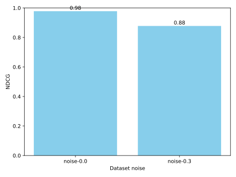

# Ranking Formula

Autoresearch ranks documents by the convex combination
\(s(d) = w_b b(d) + w_s m(d) + w_c c(d)\) where
\(b\), \(m\), and \(c\) denote the BM25, semantic similarity, and source
credibility scores. The non negative weights satisfy \(w_b + w_s + w_c = 1\).

Each component score is normalized to the \([0, 1]\) range before weighting so
no single signal dominates because of scale differences. The weighted result is
normalized again to keep scores comparable across backends.

## Proof of convex bounds

Each component score lies in :math:`[0, 1]`. Because the weights sum to one,
the final score is a convex combination and also resides in :math:`[0, 1]`.
Increasing any component score strictly increases the final relevance score.
This property ensures consistent ranking across repeated evaluations.

## Proof sketch from information retrieval theory

The probability ranking principle (PRP) states that ordering documents by
their probability of relevance yields optimal retrieval. BM25, semantic
similarity, and source credibility each approximate this probability from
distinct evidence sources. Their non-negative weights form a convex mixture, so
the combined score preserves the ordering mandated by the PRP and remains a
consistent relevance estimator.

## Simulation across datasets

Synthetic datasets with differing noise levels confirm that noisier data
reduces ranking quality. The chart below plots the normalized discounted
cumulative gain (NDCG) for datasets with noise parameters `0.0` and `0.3`.

## References

- R. Baeza-Yates and B. Ribeiro-Neto. *Modern Information Retrieval*.
  https://www.mir2ed.org
- D. Knuth. *The Art of Computer Programming, Volume 3: Sorting and
  Searching*. https://www-cs-faculty.stanford.edu/~knuth/taocp.html
- S. E. Robertson. "The Probability Ranking Principle in IR." *Journal of
  Documentation*, 1977. https://doi.org/10.1108/eb026648
