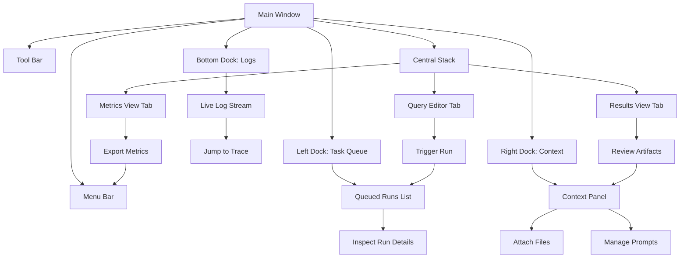

# PySide6 Layout Diagram

This document illustrates the layout and primary interactions of the PySide6
application.

```mermaid
graph TD
    MainWindow[Main Window]
    MenuBar[Menu Bar]
    ToolBar[Tool Bar]
    CentralStack[Central Stack]
    LeftDock[Left Dock: Task Queue]
    RightDock[Right Dock: Context]
    BottomDock[Bottom Dock: Logs]

    MainWindow --> MenuBar
    MainWindow --> ToolBar
    MainWindow --> CentralStack
    MainWindow --> LeftDock
    MainWindow --> RightDock
    MainWindow --> BottomDock

    CentralStack --> QueryEditor[Query Editor Tab]
    CentralStack --> ResultsView[Results View Tab]
    CentralStack --> MetricsView[Metrics View Tab]

    LeftDock --> QueueList[Queued Runs List]
    QueueList --> InspectRun[Inspect Run Details]

    RightDock --> ContextPanel[Context Panel]
    ContextPanel --> AttachFiles[Attach Files]
    ContextPanel --> ManagePrompts[Manage Prompts]

    BottomDock --> LogStream[Live Log Stream]
    LogStream --> JumpToTrace[Jump to Trace]

    QueryEditor --> TriggerRun[Trigger Run]
    TriggerRun --> QueueList

    ResultsView --> ReviewArtifacts[Review Artifacts]
    ReviewArtifacts --> ContextPanel

    MetricsView --> ExportMetrics[Export Metrics]
    ExportMetrics --> MenuBar
```
