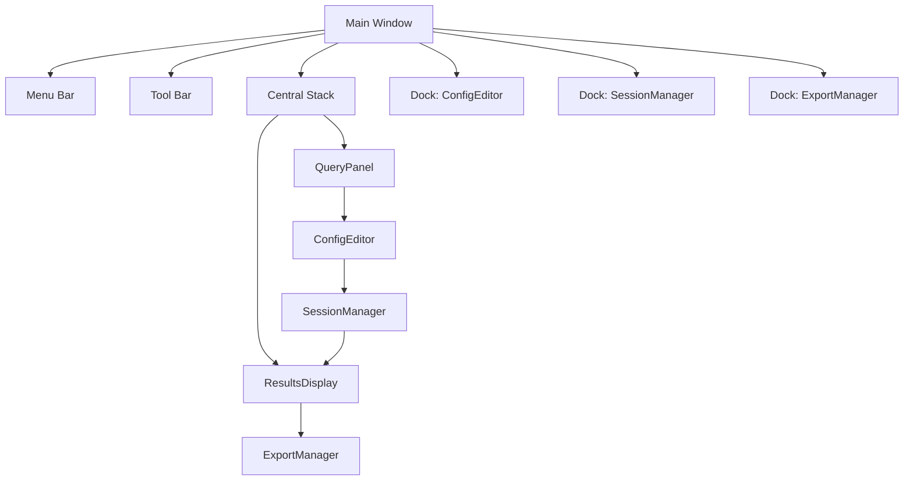
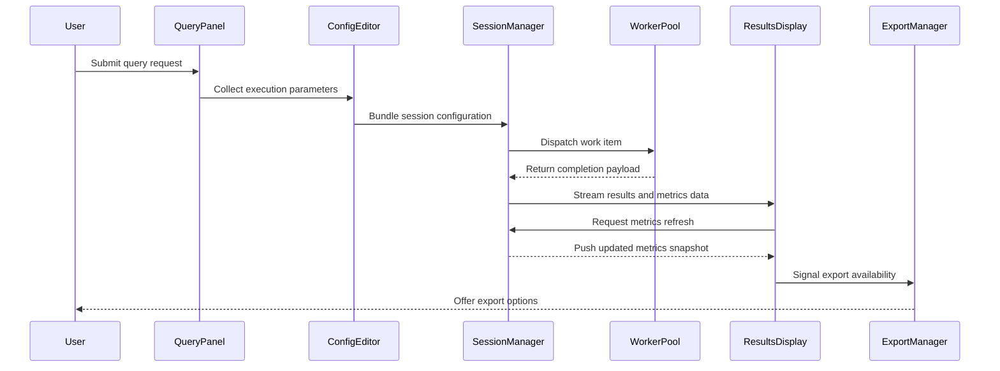

# PySide6 Layout Diagram

This document illustrates the layout and primary interactions of the PySide6
application using the current widget names.

## Visual References

Supporting screenshots and wireframes will be stored under
`docs/images/pyside6_layout/` (placeholder). Add new assets to that directory
and reference them here once captures are available.
