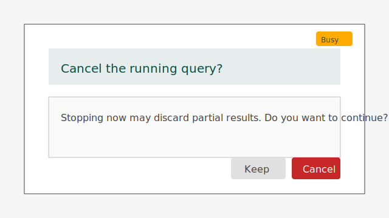
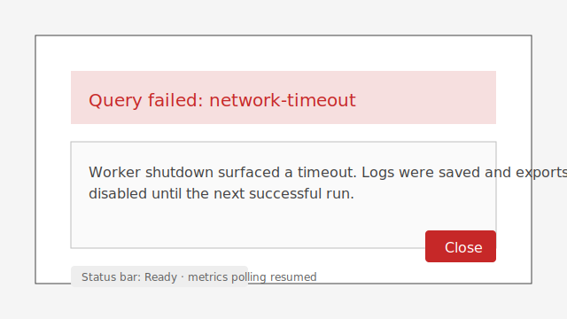

# PySide6 Layout Diagram

This document illustrates the layout and primary interactions of the PySide6
application using the current widget names.

The ResultsDisplay tab stack now incorporates a structured search results pane
adjacent to the narrative answer, providing a dedicated table for ranked hits
alongside the existing citations, knowledge graph, and metrics views.

## Visual References

*Figure 1: Baseline window composition showing QueryPanel and dock widgets
required for the Phase 1 stories about keyboard-first submission, accessible
configuration controls, and results parity.*

*Figure 2: Running-query feedback emphasising progress, disabled controls, and
export gating tied to Phase 1 cancellation and status feedback stories.*

*Figure 3: Cancellation prompt illustrating the modal copy, destructive
confirmation button, and persistent busy overlay used before worker teardown.*

*Figure 4: Error state showing the critical dialog, status-bar reset, and
export gating after a cancellation surfaces a worker failure.*
