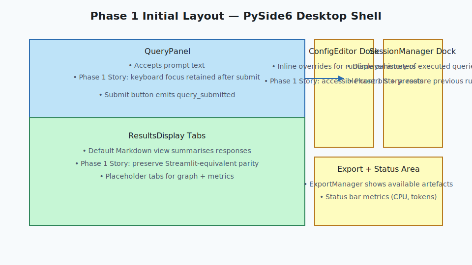

# PySide6 Layout Diagram

This document illustrates the layout and primary interactions of the PySide6
application using the current widget names.

## Visual References

*Figure 1: Baseline window composition showing QueryPanel and dock widgets
required for the Phase 1 stories about keyboard-first submission, accessible
configuration controls, and results parity.*

*Figure 2: Running-query feedback emphasising progress, disabled controls, and
export gating tied to Phase 1 cancellation and status feedback stories.*
