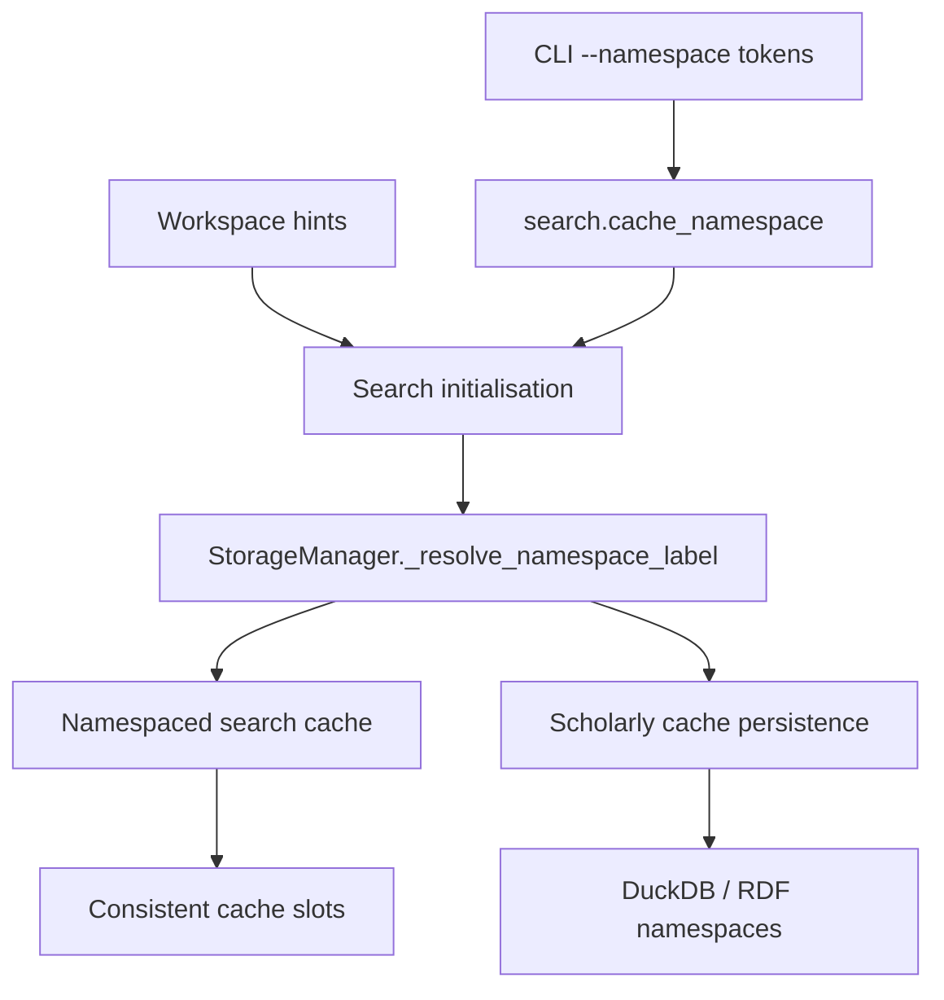

# Storage Namespace Flow

The diagram highlights how scoped namespace tokens propagate from CLI inputs and
workspace context into the search cache and scholarly storage layers.

```mermaid
flowchart TD
    cli["CLI --namespace tokens"] --> cfg["search.cache_namespace"]
    workspace["Workspace hints"] --> searchInit["Search initialisation"]
    cfg --> searchInit
    searchInit --> resolver["StorageManager._resolve_namespace_label"]
    resolver --> cacheView["Namespaced search cache"]
    resolver --> scholarly["Scholarly cache persistence"]
    cacheView --> reuse["Consistent cache slots"]
    scholarly --> storage["DuckDB / RDF namespaces"]
```
