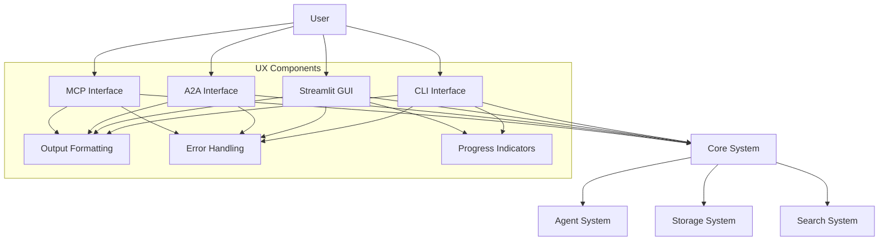
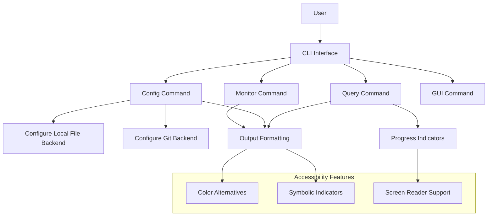
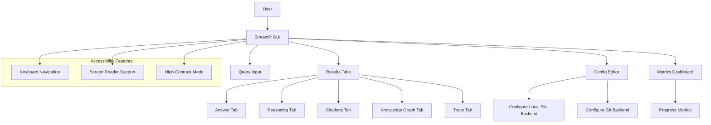
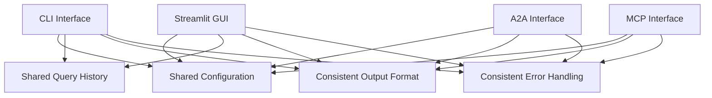
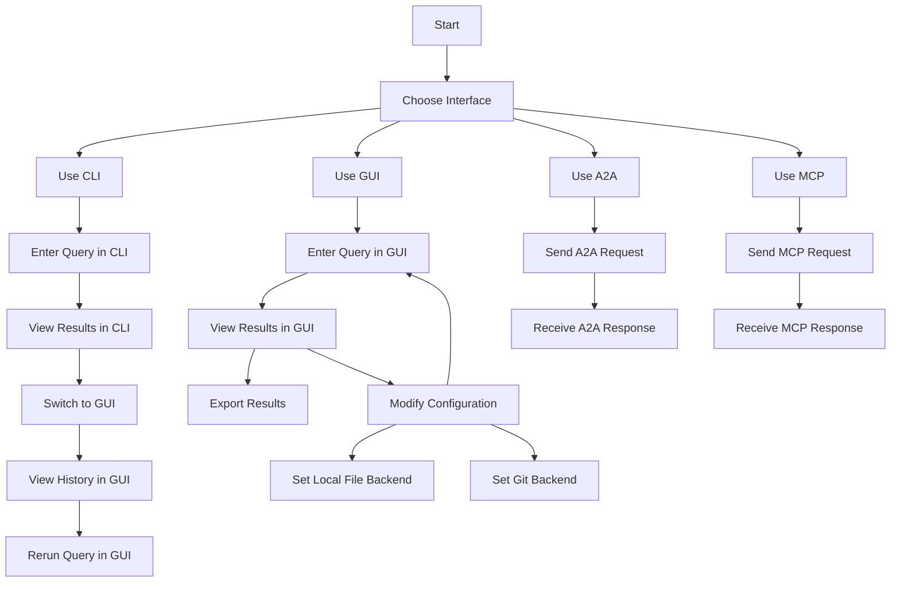

# UX Architecture Diagrams

This document provides architecture diagrams highlighting the UX components of the Autoresearch system.

## Overall Architecture with UX Components

## CLI Interface Components

## Streamlit GUI Components

## Cross-Modal Integration

## User Flow Diagram

These diagrams provide a high-level overview of the UX architecture of the Autoresearch system, highlighting the different interfaces, their components, and how they interact with each other and the core system.