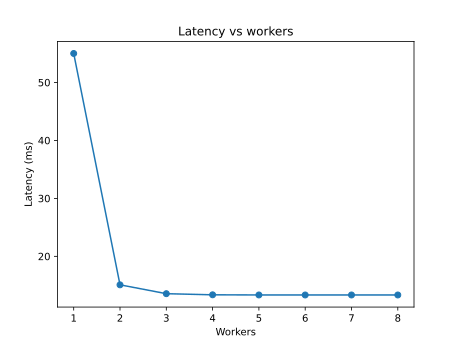
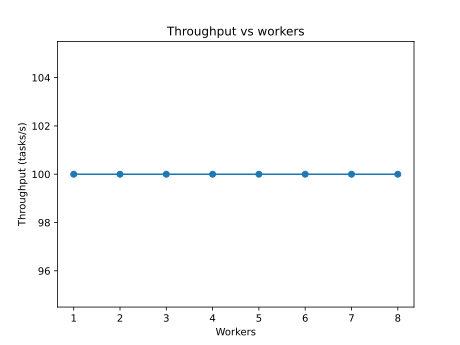

# Distributed Coordination

Autoresearch can dispatch agents across processes or nodes. The
`ProcessExecutor` uses Python's `multiprocessing` module, while
`RayExecutor` runs agents on a Ray cluster. Both executors share data
through a message broker:

- `memory`: in-process queues suitable for local testing.
- `redis`: uses a Redis instance for cross-node communication.
- `ray`: relies on Ray's distributed queue actor.

Configure the executor in `ConfigModel.distributed_config` and set the
`message_broker` field to one of the above options. The optional
`broker_url` provides the Redis connection string. For Ray, ensure a
cluster is running and specify its address in `distributed_config`.

When the distributed flag is enabled, claims are persisted by a storage
coordinator and agent results are aggregated asynchronously. Each broker
supports a `publish` method and a `queue` attribute with `put` and `get`
operations.

## Resource cleanup

Multiprocessing queues spawn feeder threads that must be terminated
explicitly. Before tests exit, call `close()` and `join_thread()` on every
queue. The brokers' `shutdown()` method performs this cleanup, so tests should
invoke it whenever a broker is created. Likewise, ensure any custom pools or
queues created in tests are closed in a `finally` block to prevent resource
tracker errors.

## Analytical performance model

We model the orchestrator as an M/M/c queue with a fixed dispatch delay
`d`. Tasks arrive at rate `λ` and each worker completes tasks at rate
`μ`. The system is stable only when the utilization `ρ = λ / (c μ)` is
less than one.

The probability of zero tasks in the system is

```
P0 = [ Σ_{n=0}^{c-1} (λ/μ)^n / n! + (λ/μ)^c / (c!(1-ρ)) ]^{-1}
```

The average queue length is

```
L_q = [(λ/μ)^c ρ / (c!(1-ρ)^2)] P0
```

The average latency combines network delay with queueing effects:

```
T = d + L_q/λ + 1/μ
```

Throughput equals the arrival rate `λ` while `ρ < 1`. The script
`scripts/distributed_perf_sim.py` evaluates these equations across worker
counts. The plots below use `λ = 100` tasks/s, `μ = 120` tasks/s, and
`d = 0.005` s.





For empirical validation, compare these projections with the benchmark
results from `scripts/distributed_orchestrator_perf_benchmark.py`.

## Orchestrator Simulation

The `distributed_orchestrator_sim.py` script models scheduling and resource
usage for a pool of worker processes. Each task incurs a dispatch delay and an
execution time, giving a simple formula for end-to-end latency:

- `avg_latency_s = mean(completion - dispatch_start)`
- `throughput = tasks / total_duration`
- `cpu_percent` and `memory_mb` are sampled by `ResourceMonitor`.

### Methodology

1. Start `ResourceMonitor` with a 50 ms sampling interval.
2. For each task, wait for `network_latency` seconds to simulate dispatch, then
   execute a sleep of `task_time` seconds on a worker.
3. Record start and completion times to compute average scheduling latency.
4. Aggregate throughput and resource metrics after all tasks finish.

### Example Results

Running the command below produced the metrics that follow:

```
uv run scripts/distributed_orchestrator_sim.py --workers 2 --tasks 20 \
    --network-latency 0.01 --task-time 0.01
```

```
{
  "avg_latency_s": 0.075,
  "throughput": 97.16,
  "cpu_percent": 0.0,
  "memory_mb": 45.06
}
```

These formulas and metrics help tune worker counts and latency budgets when
deploying the distributed orchestrator.

## Performance benchmark

We evaluated `distributed_orchestrator_perf_benchmark.py`:

```
PYTHONPATH=. uv run scripts/distributed_orchestrator_perf_benchmark.py \
    --max-workers 4 --network-latency 0.005 --tasks N
```

Tasks take 5 ms, giving a service rate of 200 tasks/s per worker.

### 500 tasks

| workers | avg latency (ms) | throughput (tasks/s) | memory (MB) |
| ------- | ---------------- | ------------------- | ----------- |
| 1 | 12.22 | 81.82 | 50.56 |
| 2 | 7.32 | 136.58 | 50.81 |
| 3 | 5.72 | 174.90 | 50.94 |
| 4 | 4.79 | 208.98 | 50.93 |

### 800 tasks

| workers | avg latency (ms) | throughput (tasks/s) | memory (MB) |
| ------- | ---------------- | ------------------- | ----------- |
| 1 | 12.21 | 81.93 | 51.41 |
| 2 | 7.33 | 136.35 | 51.66 |
| 3 | 5.51 | 181.54 | 51.79 |
| 4 | 4.75 | 210.57 | 51.79 |

### 1200 tasks

| workers | avg latency (ms) | throughput (tasks/s) | memory (MB) |
| ------- | ---------------- | ------------------- | ----------- |
| 1 | 11.71 | 85.40 | 52.19 |
| 2 | 6.98 | 143.26 | 52.21 |
| 3 | 5.63 | 177.77 | 52.24 |
| 4 | 4.56 | 219.53 | 52.37 |

## Follow-up benchmarks and monitoring

- Vary task processing time to study sensitivity to service rate changes.
- Emit latency and memory metrics to a monitoring system for live tuning.
