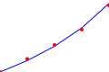

# Orchestrator Performance

This document summarizes the assumptions and formulas used for the
distributed orchestrator performance simulation.

## Assumptions

- Task arrivals follow a Poisson process with rate \(\lambda\).
- Service times are exponentially distributed with rate \(\mu\).
- The system behaves as an M/M/c queue with \(c\) workers.
- Network delay adds a fixed latency per task.
- Throughput is \(\min(\lambda, c\mu)\). Latency is computed only when
  \(\lambda < c\mu\).

## Formulas

Utilization:
\(\rho = \lambda / (c\mu)\)

Probability of zero tasks:
\(P_0 = \Big(\sum_{n=0}^{c-1} (\lambda/\mu)^n / n! +\
(\lambda/\mu)^c /(c!(1-\rho))\Big)^{-1}\)

Average queue length:
\(L_q = P_0 (\lambda/\mu)^c \rho / (c!(1-\rho)^2)\)

Wait time in queue:
\(W_q = L_q / \lambda\)

Total latency:
\(L = d + W_q + 1/\mu\)

## Coordination Overhead

Each task requires dispatch and result collection, adding coordination delay
\(t_c\) per task. The effective service rate becomes
\(\mu_{\text{eff}} = 1 / (1/\mu + t_c)\). The relative overhead is
\(O = 1 - \mu_{\text{eff}}/\mu = t_c \mu / (1 + t_c \mu)\).
Latency with coordination is
\(L = d + W_q + 1/\mu_{\text{eff}}\).

## Throughput and Latency Curves

Throughput saturates at \(\min(\lambda, c\mu_{\text{eff}})\), while
latency drops sharply once \(c\mu_{\text{eff}} > \lambda\).
Example curves for \(\lambda = 120\) tasks/s, \(\mu = 50\) tasks/s, and
\(d = 5\) ms are shown below.

| workers | throughput | latency (s) |
| ------- | ---------- | ----------- |
| 3 | 120 | 0.0466 |
| 4 | 120 | 0.0286 |
| 5 | 120 | 0.0259 |

## Failure Recovery

If a worker fails, remaining workers drain the queue. Throughput temporarily
falls to \(\min(\lambda, (c-1)\mu_{\text{eff}})\) but no tasks are lost.
Safety and liveness are preserved by the result aggregator. See
[distributed coordination](algorithms/distributed_coordination.md) for more
background.

## Benchmark

We validated the analytical model with a discrete-event simulation running
100 tasks while varying workers and adding 5 ms of dispatch latency. The
throughput curve matches the \(\min(\lambda, c\mu_{\text{eff}})\)
prediction, and latency decreases as workers scale.

![Benchmark throughput and latency]
(images/distributed_orchestrator_perf_benchmark.svg)

## Failure Overhead Simulation

A discrete-event simulation explored the cost of task retries across multiple
workers. For failure probability \(p\), each task runs on average
\(1/(1-p)\) times as shown in
[distributed overhead](algorithms/distributed_overhead.md). Running 300 tasks
with three workers and \(p = 0.2\) yielded an observed overhead of roughly
\(1.25\) and throughput near the theoretical
\(\Theta = w (1 - p) / (d + s)\). The measured values aligned with these
formulas.

The figure compares measured executions per task against the \(1/(1-p)\)
model, demonstrating agreement between analysis and simulation.

## Recent benchmarks

Empirical runs on 2025-09-08 validated the model using
`scripts/distributed_orchestrator_sim.py` and
`scripts/distributed_orchestrator_perf_benchmark.py`. Each run dispatched
100 tasks with 5 ms of network delay.

Throughput is computed as \( \text{tasks} / t \) and latency as \( t /
\text{tasks} \) where \( t \) is runtime in seconds.

| workers | avg latency (s) | throughput (tasks/s) |
| ------- | --------------- | -------------------- |
| 1 | 0.0142 | 70.42 |
| 2 | 0.0103 | 96.73 |
| 3 | 0.0086 | 115.65 |
| 4 | 0.0078 | 128.36 |

These results show diminishing returns beyond four workers. Scale workers
until throughput approaches the arrival rate; additional workers add little
benefit once latency meets requirements.
