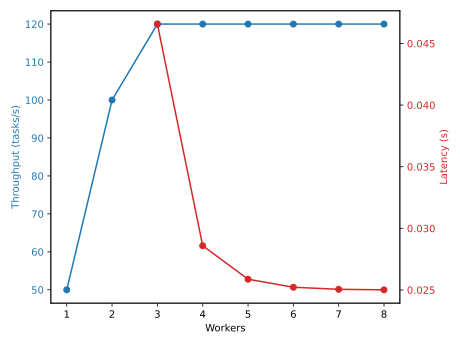
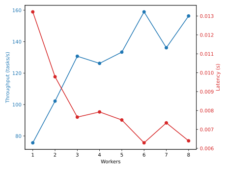

# Orchestrator Performance

This document summarizes the assumptions and formulas used for the
distributed orchestrator performance simulation.

## Assumptions

- Task arrivals follow a Poisson process with rate \(\lambda\).
- Service times are exponentially distributed with rate \(\mu\).
- The system behaves as an M/M/c queue with \(c\) workers.
- Network delay adds a fixed latency per task.
- Throughput is \(\min(\lambda, c\mu)\). Latency is computed only when
  \(\lambda < c\mu\).

## Formulas

Utilization:
\(\rho = \lambda / (c\mu)\)

Probability of zero tasks:
\(P_0 = \Big(\sum_{n=0}^{c-1} (\lambda/\mu)^n / n! + (\lambda/\mu)^c /(c!(1-\rho))\Big)^{-1}\)

Average queue length:
\(L_q = P_0 (\lambda/\mu)^c \rho / (c!(1-\rho)^2)\)

Wait time in queue:
\(W_q = L_q / \lambda\)

Total latency:
\(L = d + W_q + 1/\mu\)

## Example

Example curves for \(\lambda = 120\) tasks/s, \(\mu = 50\) tasks/s, and
\(d = 5\) ms are shown below.

| workers | throughput | latency (s) |
| ------- | ---------- | ----------- |
| 3 | 120 | 0.0466 |
| 4 | 120 | 0.0286 |
| 5 | 120 | 0.0259 |

## Benchmark

We validated the analytical model with a discrete-event simulation running
100 tasks while varying workers and adding 5 ms of dispatch latency. The
throughput curve matches the \(\min(\lambda, c\mu)\) prediction, and
latency decreases as workers scale.

