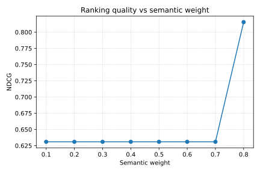

# Ranking Benchmark

The ranking pipeline lives in `src/autoresearch/search/core.py`, where
`rank_results` combines BM25, semantic similarity, and credibility scores
with configurable weights to order search results.

The ranking quality is measured with normalized discounted cumulative gain
(NDCG):

\[
\mathrm{NDCG} =
\frac{1}{\mathrm{IDCG}} \sum_{i=1}^n \frac{2^{rel_i}-1}{\log_2(i+1)}
\]

We evaluated weight settings using `scripts/ranking_weight_benchmark.py` and
the sample dataset `examples/search_evaluation.csv`. The plot shows how
NDCG varies when the credibility weight is fixed at 0.2 and the semantic
weight is swept from 0.1 to 0.8.

## Backend Metrics

Precision, recall, and average latency were measured on the shared dataset
`tests/data/backend_benchmark.csv` using a 0.5 score threshold and 1,000
iterations for timing.

| Backend  | Precision | Recall | Latency (ms) |
|----------|-----------|--------|--------------|
| bm25     | 1.00      | 1.00   | 1.68         |
| semantic | 0.50      | 1.00   | 1.61         |
