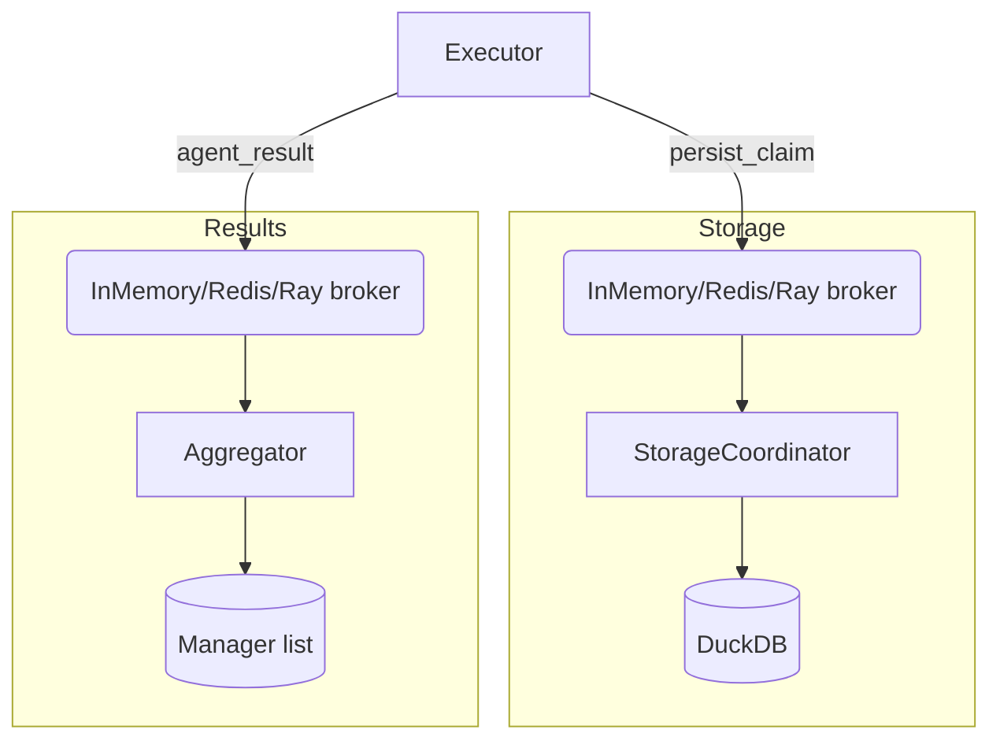

# Distributed Execution

## Overview

Distributed orchestration spreads agent work across local processes or Ray
clusters while maintaining a single source of truth for claims and results.
The design combines pluggable message brokers, background coordinator
processes, and executors that dispatch agents in parallel. Mathematical
analysis appears in
[distributed coordination](../algorithms/distributed_coordination.md),
[distributed overhead](../algorithms/distributed_overhead.md), and
[distributed perf](../algorithms/distributed_perf.md).

## Algorithms

### get_message_broker

1. Accept a broker name (`memory`, `redis`, or `ray`) and optional URL.
2. Return `InMemoryBroker` backed by `_CountingQueue`, which tracks queue
   length via a shared counter so `empty()` becomes reliable across
   processes.
3. Return `RedisBroker` when `redis` is requested; encode dictionaries as
   JSON strings and push them to a Redis list. Import errors raise
   `ModuleNotFoundError` with setup guidance.
4. Return `RayBroker` when `ray` is requested; create a
   `ray.util.queue.Queue` actor and lazily initialise Ray if needed.
5. Raise `ValueError` for unsupported broker names.

### StorageCoordinator

1. Spawn as a daemon `multiprocessing.Process` with a broker queue and DuckDB
   path.
2. Initialise storage with `storage.setup`, set a readiness event, and consume
   queue messages in a loop.
3. Persist claims when `action == "persist_claim"`; exit on `"stop"` or when
   queue access fails because the producer shut down.
4. Call `storage.teardown()` and close the queue (`close()` + `join_thread()`)
   inside a suppression block during shutdown.

### ResultAggregator

1. Spawn as a daemon process with a broker queue and a `multiprocessing`
   manager list (`self.results`).
2. Append messages when `action == "agent_result"` so parents can read the
   aggregated state without extra IPC.
3. Exit when receiving `"stop"` or when the queue closes, then close the
   queue handles just like the coordinator.

### publish_claim

1. Wrap a claim dictionary with `action` and `partial_update` metadata.
2. Enqueue the payload on the supplied broker so the background coordinator
   is the only process writing to persistent storage.

### start_storage_coordinator

1. Derive broker configuration (`message_broker`, `broker_url`) from
   `ConfigModel.distributed_config`.
2. Instantiate the broker and coordinator with a readiness `Event`.
3. Start the process, wait for readiness, and return both the coordinator and
   broker to the caller for lifecycle management.

### start_result_aggregator

1. Reuse broker selection to create a second broker dedicated to agent
   results.
2. Spawn a `ResultAggregator` draining that queue into shared memory.
3. Return the aggregator and broker so callers can publish stop signals and
   tear everything down.

### RayExecutor.run_query

1. Inspect `ConfigModel.distributed` and `distributed_config.enabled` to
   decide whether to start background coordinators.
2. Capture HTTP and LLM client sessions, push them to Ray via `ray.put`, and
   reuse the resulting object references during remote execution.
3. For each loop:
   - Reset `ResultAggregator.results` if present.
   - Dispatch `_execute_agent_remote` Ray tasks for every agent name.
   - Retrieve Ray futures, preferring aggregator output when available.
   - Apply each result to `QueryState`, publish associated claims, and invoke
     `on_cycle_end` callbacks.
4. Return `state.synthesize()` after all loops complete.

### RayExecutor.shutdown

1. Publish `{"action": "stop"}` to the storage broker, join the coordinator,
   and tear down the broker while clearing the storage queue hook.
2. Repeat the stop-signal, join, and shutdown sequence for the result broker
   and aggregator.
3. Call `ray.shutdown()` when Ray exposed the symbol.

### ProcessExecutor.run_query

1. Mirror Ray setup: start background coordinators when distributed mode is
   enabled.
2. For each loop:
   - Reset the aggregator buffer if running.
   - Create a spawn-context `multiprocessing.Pool` sized by
     `distributed_config.num_cpus`.
   - Execute `_execute_agent_process` for each agent, forwarding brokers so
     results and claims flow through the shared infrastructure.
   - Merge aggregator output, update `QueryState`, publish claims, and invoke
     callbacks.
3. Return `state.synthesize()` when loops finish.

### ProcessExecutor.shutdown

1. Publish stop messages and join background processes exactly as in the Ray
   variant.
2. Shut down brokers (`shutdown()`) and reset storage queue hooks to avoid
   leaking shared resources.

## Flow Diagrams

## Invariants

- Brokers accept only `persist_claim`, `agent_result`, and `stop` actions.
- `_CountingQueue` keeps an exact queue length so `empty()` cannot report
  false negatives even with background feeder threads.
- Coordinators close queues and join helper threads during shutdown, avoiding
  leaked descriptors and flaky tests.
- Executors clear aggregator buffers each loop, ensuring the parent state
  reflects results from the current cycle only.
- Storage claims are persisted exactly once because the coordinator is the
  sole consumer of the storage queue.
- `get_message_broker` always returns a functioning broker or raises a clear
  error that explains missing optional dependencies.

## Complexity

- Queue operations in all brokers run in `O(1)` time for payload size `s`; the
  Ray variant inherits this bound from `ray.util.queue.Queue`.
- `RayExecutor.run_query` performs `O(L × A)` work for `L` loops and `A`
  agents, plus the cost of Ray deserialisation which is linear in payload
  size.
- `ProcessExecutor.run_query` adds `O(L × P)` pool management overhead for `P`
  workers, keeping overall cost linear in the number of agent executions.

## Proof Sketch

The queue ordering, safety, and liveness arguments in
[distributed coordination](../algorithms/distributed_coordination.md) apply
directly. A single coordinator drains the storage queue, so FIFO order matches
publish order and each claim persists exactly once. Executors publish explicit
`stop` messages that the background processes treat as barriers, guaranteeing
that no in-flight work is skipped during shutdown.

The updated
[distributed_coordination_sim.py](../../scripts/distributed_coordination_sim.py)
script exercises both brokers concurrently: simulated agents emit results and
claims, the aggregator collects them, and the driver drains the storage queue
to confirm FIFO delivery. The simulation reports duplicates or ordering
violations, providing an executable witness for the proof sketch.

## Simulation Expectations

- [distributed_coordination_formulas.py][s1] derives allocation and failure
  overhead formulas.
- [distributed_coordination_sim.py][s2] now simulates result aggregation and
  claim persistence flow, reporting ordering violations.
- [distributed_recovery_benchmark.py][s3] measures CPU and memory impact when
  retries occur.
- [orchestrator_distributed_sim.py][s4] benchmarks distributed orchestration
  loops and records scaling metrics.

## Traceability

- Modules
  - [src/autoresearch/distributed/__init__.py][m1]
  - [src/autoresearch/distributed/broker.py][m2]
  - [src/autoresearch/distributed/coordinator.py][m3]
  - [src/autoresearch/distributed/executors.py][m4]
- Tests
  - [tests/analysis/test_distributed_coordination.py][t56]
  - [tests/benchmark/test_orchestrator_distributed_sim.py][t57]
  - [tests/integration/test_distributed_agent_storage.py][t58]
  - [tests/unit/distributed/test_coordination_properties.py][t59]
  - [tests/unit/legacy/test_distributed.py][t2]
  - [tests/unit/legacy/test_distributed_extra.py][t60]
  - [tests/unit/legacy/test_distributed_executors.py][t137]

[m1]: ../../src/autoresearch/distributed/__init__.py
[m2]: ../../src/autoresearch/distributed/broker.py
[m3]: ../../src/autoresearch/distributed/coordinator.py
[m4]: ../../src/autoresearch/distributed/executors.py
[t2]: ../../tests/unit/legacy/test_distributed.py
[s1]: ../../scripts/distributed_coordination_formulas.py
[s2]: ../../scripts/distributed_coordination_sim.py
[s3]: ../../scripts/distributed_recovery_benchmark.py
[s4]: ../../scripts/orchestrator_distributed_sim.py

[t56]: ../../tests/analysis/test_distributed_coordination.py
[t57]: ../../tests/benchmark/test_orchestrator_distributed_sim.py
[t58]: ../../tests/integration/test_distributed_agent_storage.py
[t59]: ../../tests/unit/distributed/test_coordination_properties.py
[t60]: ../../tests/unit/legacy/test_distributed_extra.py
[t137]: ../../tests/unit/legacy/test_distributed_executors.py
