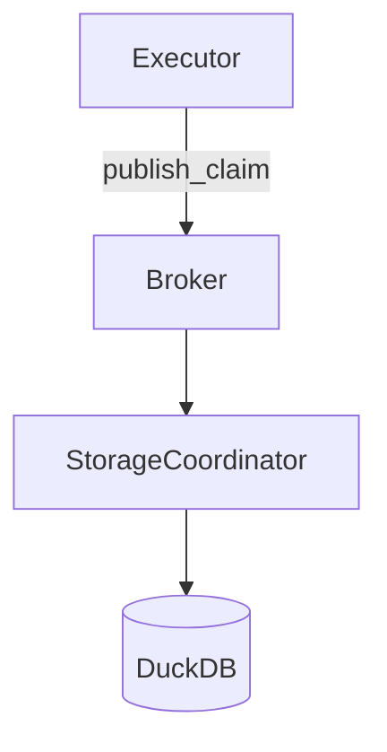
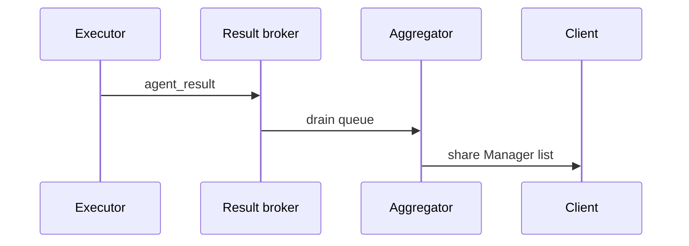

# Distributed

## Overview

Distributed orchestration utilities that coordinate agent execution across
processes or Ray workers. The package provides pluggable brokers, background
processes for storage persistence and result aggregation, and executors that
fan out agent work while maintaining consistency guarantees. Mathematical
models and proofs appear in
[distributed coordination](../algorithms/distributed_coordination.md) and
[distributed overhead](../algorithms/distributed_overhead.md).

## Algorithms

### get_message_broker

1. Accept a broker name (`memory`, `redis`, or `ray`) and optional URL.
2. Return `InMemoryBroker` with `_CountingQueue` for local queues.
3. Return `RedisBroker` backed by a JSON-encoded Redis list when `redis` is
   selected; raise when the `redis` package is absent.
4. Return `RayBroker` configured via `ray.util.queue.Queue` when `ray` is
   selected; lazily initialise Ray if needed.
5. Raise `ValueError` for unsupported broker names.

### StorageCoordinator

1. Spawned as a daemon `multiprocessing.Process` with access to a broker queue
   and DuckDB path.
2. Initialise storage via `storage.setup`, set a readiness event, and consume
   messages.
3. Persist claims when `action == "persist_claim"`; exit when `action == "stop"`
   or the queue closes.
4. Tear down storage and close the queue on exit.

### ResultAggregator

1. Spawned as a daemon process with a broker queue.
2. Store results in a `multiprocessing.Manager().list()` for cross-process
   sharing.
3. Append messages when `action == "agent_result"`; exit on `"stop"` or queue
   shutdown.

### publish_claim

1. Serialize claim dictionaries with action metadata and enqueue them on the
   chosen broker, allowing executors to offload storage writes safely.

### start_storage_coordinator

1. Read distributed configuration for broker selection and optional URL.
2. Create a message broker and storage coordinator pointing at DuckDB.
3. Signal readiness through an `Event` before returning to the caller.
4. Return the coordinator process alongside its broker for lifecycle control.

### start_result_aggregator

1. Read distributed configuration to reuse the broker selection logic.
2. Spawn a `ResultAggregator` that drains the broker queue into shared memory.
3. Return the aggregator process with its broker for later shutdown.

### RayExecutor.run_query

1. Optionally start storage/result coordinators when distributed mode is
   enabled in configuration and capture the associated brokers.
2. Push HTTP and LLM sessions into Ray via `ray.put` for reuse.
3. For each loop:
   - Clear aggregated results.
   - Dispatch agents via `_execute_agent_remote` tasks.
   - Retrieve results with `ray.get` and merge aggregator output if available.
   - Update `QueryState`, publish claims through the storage broker, and
     invoke `on_cycle_end` callbacks.
4. Return `state.synthesize()` after all loops complete.

### RayExecutor.shutdown

1. Publish a stop signal before joining the storage coordinator.
2. Shut down the storage broker and clear the storage message queue hook.
3. Publish a stop signal for the result broker and join the aggregator.
4. Close the result broker, then call `ray.shutdown()` when available.

### ProcessExecutor.run_query

1. Optionally start storage/result coordinators similar to `RayExecutor`.
2. For each loop:
   - Clear aggregated results.
   - Use a `multiprocessing.Pool` (spawn context) to execute
     `_execute_agent_process` for each agent.
   - Merge aggregator output if present, update `QueryState`, publish claims,
     and invoke callbacks.
3. Return `state.synthesize()`.

### ProcessExecutor.shutdown

1. Publish a stop signal, join the storage coordinator, and shut down the
   broker.
2. Publish a stop signal for the result broker, join the aggregator, and close
   the broker connection.

## Flow Diagrams

## Invariants

- Brokers only emit supported actions (`persist_claim`, `agent_result`, `stop`).
- `_CountingQueue` maintains accurate length tracking, allowing `empty()` to
  report true emptiness despite multiprocessing limitations.
- Coordinators close their queues and join threads/processes on shutdown to
  prevent resource leaks.
- Executors reset aggregator buffers each loop so state reflects only current
  cycle results.
- Storage claims published by executors are persisted exactly once because the
  coordinator processes every queue message serially.
- `get_message_broker` returns a usable broker instance when dependencies are
  installed and surfaces clear errors when optional packages are missing.

## Complexity

- Queue operations in `InMemoryBroker` and `RedisBroker` run in `O(1)` time per
  message; `RayBroker` inherits the same bound from `ray.util.queue.Queue`.
- `RayExecutor.run_query` performs `O(L × A)` work for `L` loops and `A`
  agents, assuming fixed orchestration cost per agent.
- `ProcessExecutor.run_query` adds `O(L × P)` overhead for pool management with
  `P` processes but remains linear in the number of agent executions.

## Proof Sketch

The queue ordering, leader election, and safety/liveness arguments in
[distributed coordination](../algorithms/distributed_coordination.md) apply
directly: a single coordinator process drains the queue, guaranteeing FIFO
ordering, while executors publish stop signals that ensure graceful shutdown.
[distributed overhead](../algorithms/distributed_overhead.md) bounds retry
costs when failures occur. The
[distributed_coordination_sim.py](../../scripts/distributed_coordination_sim.py)
script exercises leader election and FIFO delivery, offering an executable
counterpart to the proof sketch. Tests validate broker ordering, coordination
safety, and executor convergence across multiprocessing and Ray backends.

## Simulation Expectations

- [distributed_coordination_formulas.py][s1] derives allocation and failure
  overhead formulas.
- [distributed_coordination_sim.py][s2] simulates leader election, queue
  ordering, and throughput.
- [distributed_recovery_benchmark.py][s3] measures CPU/memory impact when
  retries occur.
- [orchestrator_distributed_sim.py][s4] benchmarks distributed orchestration
  loops and records scaling metrics.

## Traceability

- Modules
  - [src/autoresearch/distributed/__init__.py][m1]
  - [src/autoresearch/distributed/broker.py][m2]
  - [src/autoresearch/distributed/coordinator.py][m3]
  - [src/autoresearch/distributed/executors.py][m4]
- Tests
  - [tests/unit/test_distributed.py][t1]
  - [tests/unit/test_distributed_extra.py][t2]
  - [tests/unit/distributed/test_coordination_properties.py][t3]
  - [tests/integration/test_distributed_agent_storage.py][t4]
  - [tests/benchmark/test_orchestrator_distributed_sim.py][t5]
  - [tests/analysis/test_distributed_coordination.py][t6]

[m1]: ../../src/autoresearch/distributed/__init__.py
[m2]: ../../src/autoresearch/distributed/broker.py
[m3]: ../../src/autoresearch/distributed/coordinator.py
[m4]: ../../src/autoresearch/distributed/executors.py
[t1]: ../../tests/unit/test_distributed.py
[t2]: ../../tests/unit/test_distributed_extra.py
[t3]: ../../tests/unit/distributed/test_coordination_properties.py
[t4]: ../../tests/integration/test_distributed_agent_storage.py
[t5]: ../../tests/benchmark/test_orchestrator_distributed_sim.py
[t6]: ../../tests/analysis/test_distributed_coordination.py
[s1]: ../../scripts/distributed_coordination_formulas.py
[s2]: ../../scripts/distributed_coordination_sim.py
[s3]: ../../scripts/distributed_recovery_benchmark.py
[s4]: ../../scripts/orchestrator_distributed_sim.py
