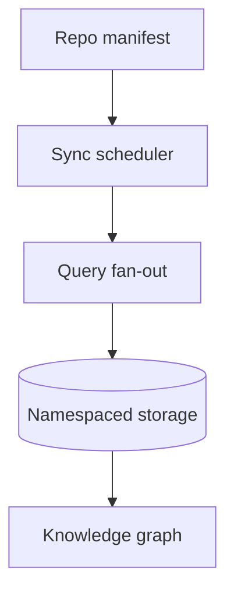

# Research Federation Enhancements

## Executive summary

Autoresearch already orchestrates dialectical agents, local Git search, and
knowledge graph storage, yet holistic research projects require orchestrating
multiple repositories, external corpora, and fine-grained namespaces. This
specification evaluates current behavior and proposes progressive enhancements
that expand repository federation, cross-resource interrogation, and scholarly
integrations while preserving local-first guarantees.

## Current capability assessment

- **Repository handling:** Local Git search scans a single repository context
  per query session, limiting comparative analysis across sibling projects.
- **Resource interrogation:** Agents gather sources but lack scoped debate
  across curated subsets (e.g., pick two repos and three PDFs for Socratic
  review).
- **Namespacing:** Storage layers segment data by run identifier yet cannot
  express hierarchical domains (organization → project → dataset) or merge
  prior knowledge without collision risks.
- **External research ingestion:** Connectors emphasize web search and local
  corpora; direct ingestion from arXiv or Hugging Face Papers requires manual
  export pipelines.

## Dialectical review

- **Thesis:** Expand Git handling to multiple repositories.
  - **Antithesis:** Additional repositories increase indexing cost and sync
    complexity.
  - **Synthesis:** Stage repositories via namespaced manifests and lazy sync
    hooks so workloads scale with analyst intent.
- **Thesis:** Add cross-examination workspaces for selected sources.
  - **Antithesis:** Agents already debate internally; extra coordination could
    duplicate effort.
  - **Synthesis:** Elevate debate to a workspace primitive that reuses
    dialectical hooks while exposing resource selection, preventing redundant
    reasoning passes.
- **Thesis:** Integrate scholarly APIs (arXiv, Hugging Face).
  - **Antithesis:** External APIs may throttle requests or drift.
  - **Synthesis:** Build pluggable fetchers with caching and provenance
    signatures so offline replay remains deterministic.

## Enhancement A – Multi-repository orchestration

**Goals:** Allow analysts to register, label, and query multiple Git
repositories per session.

**Functional requirements:**

1. Analysts can declare repositories through configuration, CLI, or UI forms
   with fields for path/URL, branch, namespace label, and a unique slug used
   across provenance payloads.
2. Search orchestration fans out queries across registered repositories while
   preserving repository-level provenance in results and knowledge graph nodes.
3. Sync policies (e.g., `on_query`, `manual`, `scheduled`) govern background
   fetch behavior and surface status via metrics and UI badges.
4. Repository manifests enforce validation for paths, branch lists, and
   namespace tokens before repositories become active.

**Non-functional requirements:**

- Repository fan-out must keep incremental updates under 3 seconds per repo when
  scanning ≤1k files (baseline measured on SSD).
- Storage namespaces must avoid collisions by combining repository slug and
  commit hash.
- Configuration must validate reachable paths/URLs before activation.

**Design considerations:**

**Test strategy:**

- Extend behavior tests with scenarios that register two repositories and verify
  per-repository hits and provenance labels. `tests/behavior/features/
  local_sources.feature` exercises manifest fan-out and provenance guards.
- Add targeted tests for manifest parsing, slug normalization, and storage key
  generation to ensure regression coverage outside the full behavior suite.

### Manifest workflow and validation

1. Configuration authors define a `local_git.manifest` array in
   `autoresearch.toml` (or the desktop editor) with entries of the form:
   `{"slug": "alpha", "path": "~/repos/alpha", "branches": ["main"],
   "namespace": "workspace.alpha"}`. Validation rejects blank paths, duplicate
   slugs, and namespaces containing whitespace.
2. CLI utilities expose `render_repository_manifest` so users can inspect the
   active manifest in either Rich or bare mode output, ensuring slugs and
   namespaces render consistently across TTY contexts.
3. The desktop config editor provides helper methods to inject or extract the
   manifest while preserving surrounding configuration, enabling UI-driven
   updates without manual JSON surgery.
4. During search fan-out each manifest entry contributes provenance metadata
   (`repository`, `namespace`) and a composite commit identifier
   (`{slug}@{commit}`) that is persisted to storage for cache reuse.

## Enhancement B – Cross-examination workspaces

**Goals:** Provide an interactive surface to select resources and run targeted
Socratic interrogations across them.

**Functional requirements:**

1. Analysts create a workspace with a curated set of repositories, files, and
   prior research notes.
2. Dialectical agents receive the workspace manifest and must cite or challenge
   each resource explicitly in their claims.
3. The UI exposes comparative timelines (claims, counterclaims, evidence) with
   filters by resource label.

**Non-functional requirements:**

- Debate runs must complete within existing reasoning SLOs (≤90 seconds default)
  by sharing cached embeddings and extraction results.
- Workspace manifests are versioned so analysts can replay debates.

**Design considerations:**

- Introduce a `WorkspaceOrchestrator` facade that wraps the existing planner but
  injects resource guards and claim-audit hooks.
- Persist workspace manifests in storage namespaces so cross-session analysis is
  reproducible.

**Test strategy:**

- Behavior scenarios assert that counterarguments reference at least one
  resource marked as challenged.
- Unit tests validate manifest serialization and replay.

## Enhancement C – Configurable knowledge namespaces

**Goals:** Give teams fine-grained control over how data, embeddings, and
knowledge graph entities are grouped and merged.

**Functional requirements:**

1. Configuration exposes namespace policies (e.g., `session`, `workspace`,
   `organization/project`) that dictate storage paths and query scopes.
2. APIs accept namespace tokens so scripts can read/write within explicit
   domains.
3. Cross-namespace queries are supported with opt-in merge strategies (e.g.,
   union, confidence-weighted merge).

**Non-functional requirements:**

- Namespace resolution adds ≤20 ms overhead per query.
- Policies must be validated to avoid cycles or orphaned namespaces.

**Design considerations:**

- Extend storage adapters with namespace-aware factories.
- Update schema definitions so knowledge graph nodes store namespace metadata.

**Test strategy:**

- Add matrix tests covering namespace policies and merge strategies.
- Ensure regression tests confirm legacy single-namespace behavior remains
  default.

## Enhancement D – Scholarly API integrations

**Goals:** Streamline ingestion from arXiv, Hugging Face Papers, and similar
sources while keeping provenance and offline caching.

**Functional requirements:**

1. Provide connectors for arXiv and Hugging Face Papers with query filters,
   metadata mapping, and PDF/text retrieval.
2. Cache fetched artifacts in local storage with deduplicated filenames derived
   from namespace + DOI/arXiv ID.
3. Surface metadata (authors, abstracts, embeddings) to agents and expose
   retrieval via CLI/UI.

**Non-functional requirements:**

- Respect provider rate limits and backoff policies.
- Provide deterministic caching for offline replay with checksum validation.

**Design considerations:**

- Implement connectors in `resources/scholarly/` with shared HTTP client and
  authentication adapters.
- Add ingestion pipelines to push metadata into the knowledge graph and storage
  namespaces defined above.

**Test strategy:**

- Mock provider APIs in unit tests; verify caching and metadata normalization.
- Behavior scenarios confirm analysts can fetch and cite papers offline after
  initial sync.

## Systems integration and holistic impacts

- Multi-repository manifests feed namespace policies, ensuring each repository
  occupies an isolated yet mergeable domain.
- Cross-examination workspaces depend on manifest replay, so connectors must
  annotate provenance uniformly.
- Monitoring must expose sync latency, namespace storage usage, and external API
  quota health to maintain observability.

## Roadmap and milestones

1. **Phase 1 – Namespace foundation (2 weeks):** Implement namespace factories,
   manifest schema, and storage upgrades. Ship regression tests.
2. **Phase 2 – Repository federation (3 weeks):** Deliver repo manifest UI/CLI,
   sync scheduler, and provenance-aware search fan-out.
3. **Phase 3 – Cross-examination workspaces (3 weeks):** Add workspace
   orchestrator, UI surfaces, and debate telemetry.
4. **Phase 4 – Scholarly connectors (2 weeks):** Build arXiv and Hugging Face
   pipelines with caching and provenance tests.
5. **Phase 5 – Observability and polish (2 weeks):** Add metrics, documentation,
   and user training guides; capture learnings in AGENTS updates.

## Traceability

- Modules: `src/autoresearch/search/`, `src/autoresearch/storage/`,
  `src/autoresearch/orchestration/`, `src/autoresearch/resources/scholarly/`
  (new), `src/autoresearch/ui/desktop/`.
- Interfaces: CLI (`main.py`), API (`api.py`), desktop UI (`ui/desktop`).
- Tests: behavior features for multi-repo workspace flows, unit tests for
  manifests, namespace policies, and connectors.

